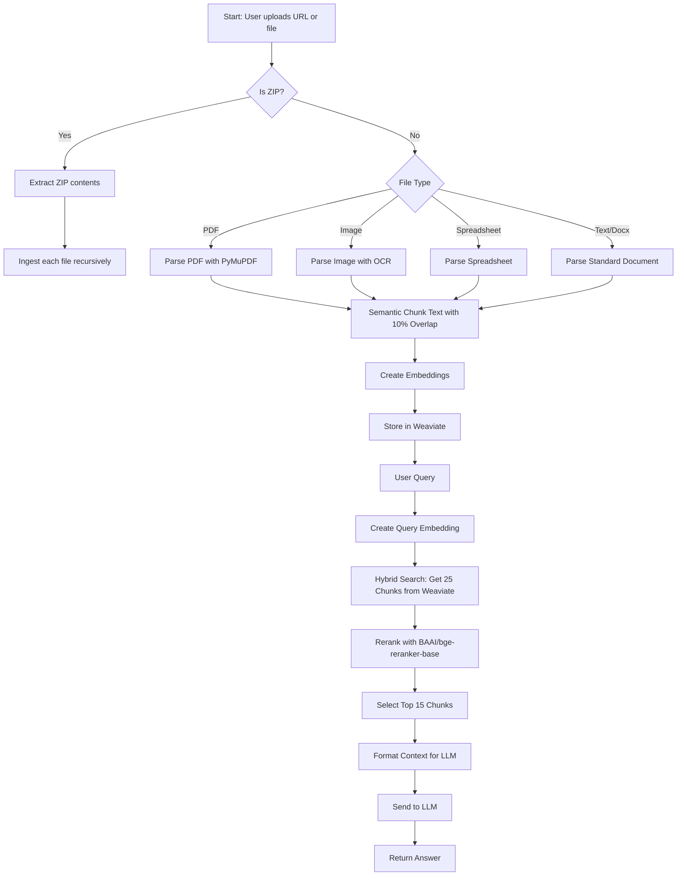

# Rag_Baj: Unified RAG Pipeline

## Overview

Rag_Baj is a high-performance Retrieval-Augmented Generation (RAG) API that ingests documents from URLs or local paths, processes them into semantic chunks, stores them in a vector database (Weaviate), and answers user queries using LLMs. The pipeline is modular, robust, and supports multiple file types, including PDFs, images (with OCR), spreadsheets, and ZIP archives.

## Features

- Unified ingestion engine for various document types
- Automatic file type detection and routing
- ZIP archive extraction and recursive ingestion
- PDF parsing with PyMuPDF
- Image OCR via `unstructured` library (if available)
- Semantic chunking with 10% overlap for better context
- Embedding creation and vector storage
- Two-stage retrieval: hybrid search + reranking with BAAI/bge-reranker-base
- FastAPI-based API endpoints for document and query processing
- Detailed logging and error handling

## Code Structure

```
components/
  chunking.py         # Semantic chunking logic
  embeddings.py       # Embedding creation
  gemini_api.py       # LLM API integration
  ingest_engine.py    # Main ingestion pipeline
  prompt_template.py  # Prompt formatting
  reranker_utils.py   # Reranking utilities
  retrieval.py        # Document retrieval logic
  search.py           # Hybrid search in Weaviate
  weaviate_db.py      # Weaviate DB connection and ingestion
  utils/logger.py     # Logging utilities
main.py               # FastAPI app and endpoints
```

## Ingestion & Retrieval Logic

1. **Ingestion**

   - Accepts a URL or local file path.
   - Downloads remote files to temp storage.
   - Detects file type and routes to the appropriate parser.
   - For ZIP files, extracts and recursively ingests contents.
   - For images, uses OCR via `unstructured` if available.
   - For PDFs, uses PyMuPDF for fast parsing.
   - Chunks text and creates embeddings.
   - Stores chunks and embeddings in Weaviate.

2. **Query Processing**
   - Accepts user queries via API.
   - Generates query embeddings.
   - Performs hybrid search in Weaviate (vector + keyword) to fetch 25 chunks.
   - Reranks the 25 chunks using BAAI/bge-reranker-base model.
   - Selects top 15 reranked chunks for context.
   - Formats context and sends to LLM for answer generation.

## Setup & Usage

1. Clone the repository and install dependencies:
   ```bash
   git clone <repo-url>
   cd Rag_Baj
   pip install -r requirements.txt
   ```
2. Start Weaviate (via Docker Compose):
   ```bash
   docker-compose up -d
   ```
3. Run the FastAPI server:
   ```bash
   uvicorn main:app --reload
   ```
4. Use the API endpoints to ingest documents and ask questions.

## Mermaid Diagram: Pipeline Flow



## Notes

- Image OCR requires the `unstructured` library and its OCR dependencies.
- All major steps are logged for debugging and monitoring.
- The pipeline is modular and easy to extend for new file types or models.

---

For more details, see the code comments and docstrings in each module.
