# HackRx RAG Pipeline

## Overview

HackRx RAG Pipeline is a high-performance Retrieval-Augmented Generation (RAG) API that ingests documents from URLs or local paths, processes them into semantic chunks, stores them in a vector database (Weaviate), and answers user queries using LLMs. The pipeline is modular, robust, and supports multiple file types, including PDFs, images (with OCR), spreadsheets, and ZIP archives.

## Features

- Unified ingestion engine for various document types
- Automatic file type detection and routing
- ZIP archive extraction and recursive ingestion
- PDF parsing with PyMuPDF
- Image OCR via `unstructured` library (if available)
- Semantic chunking with 10% overlap for better context
- Embedding creation and vector storage
- Two-stage retrieval: hybrid search + reranking with BAAI/bge-reranker-base
- FastAPI-based API endpoints for document and query processing
- Detailed logging and error handling
- Comprehensive test suite

## Documentation

For detailed documentation, please refer to the `docs` directory:

- [File Structure](docs/file_structure.md) - Detailed explanation of project organization
- [Setup Guide](docs/setup.md) - Instructions for setting up the project
- [API Reference](docs/api_reference.md) - Documentation for API endpoints
- [Testing Guide](docs/testing.md) - Information about testing the application

## Code Structure

```
components/           # Core components of the RAG pipeline
  chunking.py         # Semantic chunking logic
  embeddings.py       # Embedding creation
  gemini_api.py       # LLM API integration
  ingest_engine.py    # Main ingestion pipeline
  prompt_template.py  # Prompt formatting
  reranker_utils.py   # Reranking utilities
  retrieval.py        # Document retrieval logic
  search.py           # Hybrid search in Weaviate
  weaviate_db.py      # Weaviate DB connection and ingestion
  utils/              # Utility modules
    logger.py         # Logging utilities
    clear_Weviate.py  # Utility to clear Weaviate collections
    report_generator.py # Generate test reports
docs/                 # Documentation files
  architecture.md     # System architecture documentation
  file_structure.md   # File structure explanation
  setup.md            # Setup instructions
  api_reference.md    # API documentation
  testing.md          # Testing documentation
test/                 # Test files
  test_chunking.py    # Tests for chunking component
  test_embeddings.py  # Tests for embeddings component
  test_weaviate_rerank.py # Integration tests for Weaviate and reranking
  zip.py              # Test for ZIP file processing
main.py               # FastAPI app and endpoints
docker-compose.yaml   # Docker configuration
Dockerfile            # Docker build file
requirements.txt      # Python dependencies
```

## Ingestion & Retrieval Logic

1. **Ingestion**

   - Accepts a URL or local file path.
   - Downloads remote files to temp storage.
   - Detects file type and routes to the appropriate parser.
   - For ZIP files, extracts and recursively ingests contents.
   - For images, uses OCR via `unstructured` if available.
   - For PDFs, uses PyMuPDF for fast parsing.
   - Chunks text and creates embeddings.
   - Stores chunks and embeddings in Weaviate.

2. **Query Processing**
   - Accepts user queries via API.
   - Generates query embeddings.
   - Performs hybrid search in Weaviate (vector + keyword) to fetch 25 chunks.
   - Reranks the 25 chunks using BAAI/bge-reranker-base model.
   - Selects top 15 reranked chunks for context.
   - Formats context and sends to LLM for answer generation.

## Quick Setup

1. Clone the repository and install dependencies:
   ```bash
   git clone <repo-url>
   cd hackrx-repo
   pip install -r requirements.txt
   ```

2. Create a `.env` file with necessary configuration (see `.env.example`).

3. Start Weaviate (via Docker Compose):
   ```bash
   docker-compose up -d weaviate
   ```

4. Run the FastAPI server:
   ```bash
   uvicorn main:app --host 0.0.0.0 --port 8000 --reload
   ```

5. Use the API endpoints to ingest documents and ask questions:
   ```bash
   curl -X POST "http://localhost:8000/api/v1/hackrx/run" 
     -H "Authorization: Bearer <your-auth-token>" 
     -H "Content-Type: application/json" 
     -d '{"documents": "https://example.com/document.pdf", "questions": ["What is the main topic?"]}'
   ```

## Mermaid Diagram: Pipeline Flow

```mermaid
graph TB
    %% Define Enhanced Styles
    classDef userInput fill:#e3f2fd,stroke:#1976d2,stroke-width:3px,color:#000
    classDef ingestion fill:#f3e5f5,stroke:#7b1fa2,stroke-width:2px,color:#000
    classDef storage fill:#e8f5e8,stroke:#388e3c,stroke-width:2px,color:#000
    classDef processing fill:#fff3e0,stroke:#f57c00,stroke-width:2px,color:#000
    classDef agent fill:#fce4ec,stroke:#c2185b,stroke-width:2px,color:#000
    classDef output fill:#ffebee,stroke:#d32f2f,stroke-width:3px,color:#000
    
    %% 1. User Input Layer
    subgraph INPUT [" 🎯 USER INPUT LAYER "]
        direction LR
        U1[" 👤 User<br/>Document URL"]:::userInput
        U2[" 💬 User<br/>Query/Task"]:::userInput
    end
    
    %% 2. Document Ingestion Engine
    subgraph INGEST [" 📥 DOCUMENT INGESTION ENGINE "]
        direction TB
        I1[" 🛡️ Security &<br/>Validation"]:::ingestion
        I2[" 🔍 File Type<br/>Detection"]:::ingestion
        I2A{" 🔐 Hash Check<br/>Already Processed?"}:::ingestion
        I2B[(" 📋 Metadata<br/>Store")]:::storage
        I3[" 📄 Format Parsers<br/>(PDF, Web, OCR, DOCX)"]:::ingestion
        I4[" 🧩 Semantic<br/>Chunking"]:::ingestion
        I5[" 🧠 Generate<br/>Embeddings"]:::ingestion
        
        I1 --> I2 --> I2A
        I2A --> |"Yes, Skip Processing"| I2B
        I2A --> |"No, New File"| I3
        I3 --> I4 --> I5
        I5 --> I2B
    end
    
    %% 3. Vector Storage
    subgraph STORAGE [" 💾 VECTOR STORAGE "]
        direction TB
        DB[(" 🗄️ Weaviate<br/>Vector Database")]:::storage
    end
    
    %% 4. Query Router
    subgraph ROUTER [" 🔀 QUERY PROCESSING "]
        direction TB
        R1{" 🎯 Task Analysis<br/>& Routing"}:::processing
    end
    
    %% 5. Standard RAG Pipeline
    subgraph STANDARD [" ⚡ STANDARD RAG PIPELINE "]
        direction TB
        S1[" 🔗 Query<br/>Embedding"]:::processing
        S2[" 🔍 Hybrid<br/>Search"]:::processing
        S3[" 📊 Rerank<br/>Results"]:::processing
        S4[" 🤖 LLM Processing<br/>(Gemini + Fallbacks)"]:::processing
        
        S1 --> S2 --> S3 --> S4
    end
    
    %% 6. Agentic Pipeline
    subgraph AGENTIC [" 🚀 AGENTIC SOLVER PIPELINE "]
        direction TB
        A1[" 🤖 Initialize<br/>Agent"]:::agent
        A2[" 🔄 Reasoning<br/>Loop"]:::agent
        A3{" 💭 Need More<br/>Info?"}:::agent
        A4[" 🌐 External<br/>HTTP Tool"]:::agent
        A5[" ⚙️ Synthesize<br/>Answer"]:::agent
        
        A1 --> A2 --> A3
        A3 --> |"From Web"| A4 --> A2
        A3 --> |"Complete"| A5
    end
    
    %% 7. Final Output
    subgraph OUTPUT [" ✅ SYSTEM OUTPUT "]
        direction TB
        O1[" 💡 Final Answer<br/>& Response"]:::output
    end
    
    %% Flow Connections
    U1 --> I1
    U2 --> R1
    I2B --> DB
    R1 --> |"Simple Q&A"| S1
    R1 --> |"Complex Task"| A1
    S2 <--> DB
    A3 --> |"From Document"| S2
    S3 --> A2
    S4 --> O1
    A5 --> O1
    
    %% Styling
    style INPUT fill:#e3f2fd,stroke:#1976d2,stroke-width:2px
    style INGEST fill:#f3e5f5,stroke:#7b1fa2,stroke-width:2px
    style STORAGE fill:#e8f5e8,stroke:#388e3c,stroke-width:2px
    style ROUTER fill:#fff3e0,stroke:#f57c00,stroke-width:2px
    style STANDARD fill:#fff3e0,stroke:#f57c00,stroke-width:2px
    style AGENTIC fill:#fce4ec,stroke:#c2185b,stroke-width:2px
    style OUTPUT fill:#ffebee,stroke:#d32f2f,stroke-width:2px
```



## Testing

The project includes various test files to verify functionality:

- `test/test_chunking.py`: Unit tests for the chunking component
- `test/test_embeddings.py`: Unit tests for the embeddings component
- `test/test_weaviate_rerank.py`: Integration tests for Weaviate and reranking
- `test/test_http_integration.py`: HTTP integration tests

Run tests using:
```bash
python -m unittest discover -s test
```

## Docker Deployment

You can deploy the entire system using Docker Compose:

```bash
docker-compose up -d
```

This will start both the RAG API service and Weaviate database in containers.

## Notes

- Image OCR requires the `unstructured` library and its OCR dependencies.
- All major steps are logged for debugging and monitoring.
- The pipeline is modular and easy to extend for new file types or models.

---

For more details, see the code comments, docstrings in each module, and the documentation in the `docs` directory.

## Contributors

1. Prabir Kalwani (@PrabirKalwani)
2. Snehil Sinha (@nex7-7)
3. Aayush Shah (@aayushshah1)
4. Parmpara Srivastava (@parampara272003)