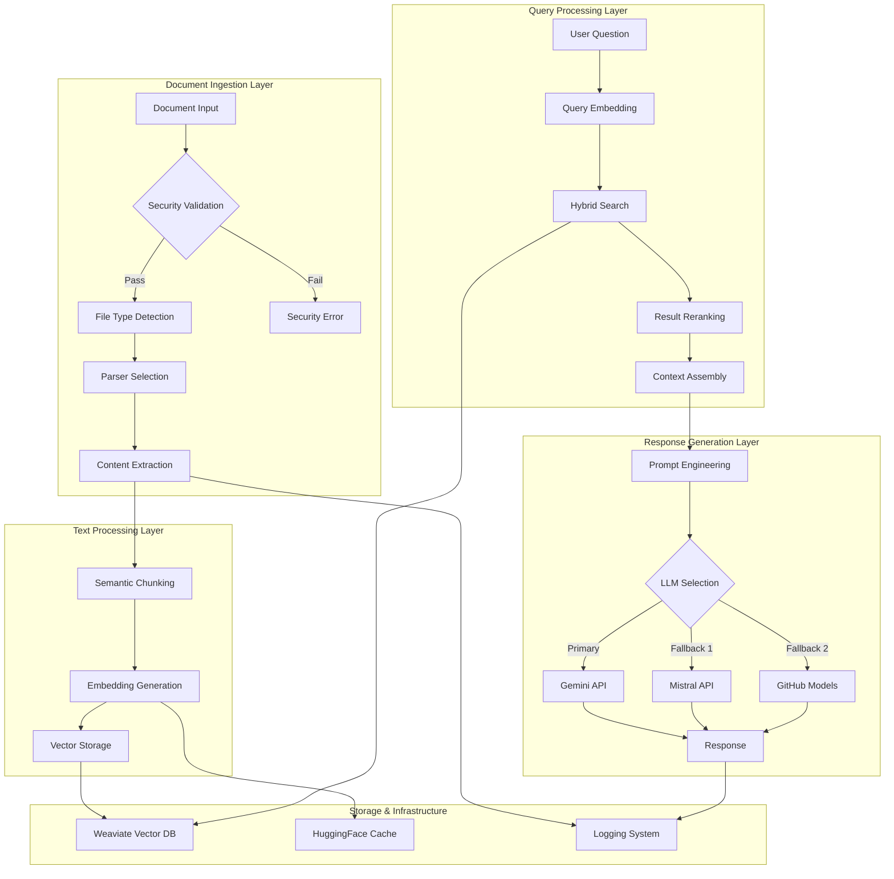
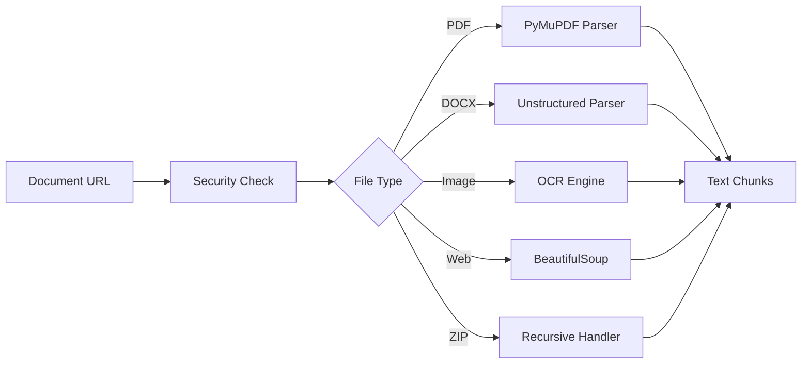
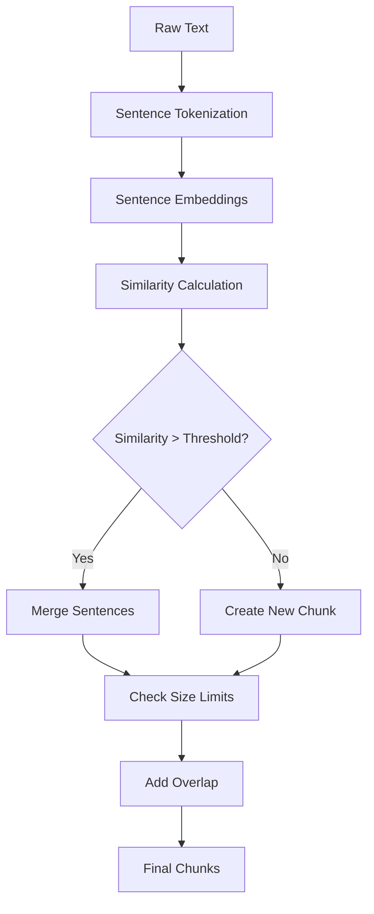
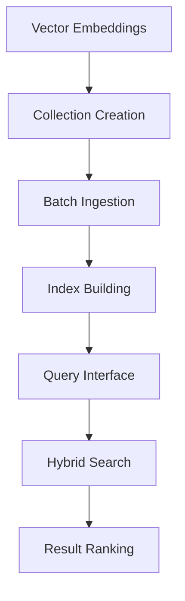
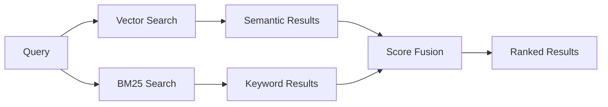
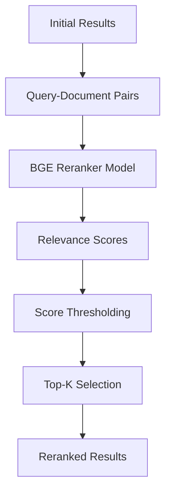
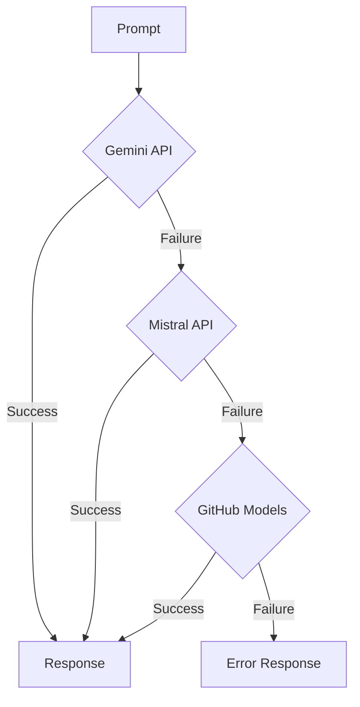
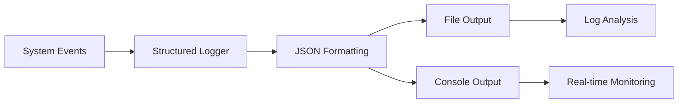
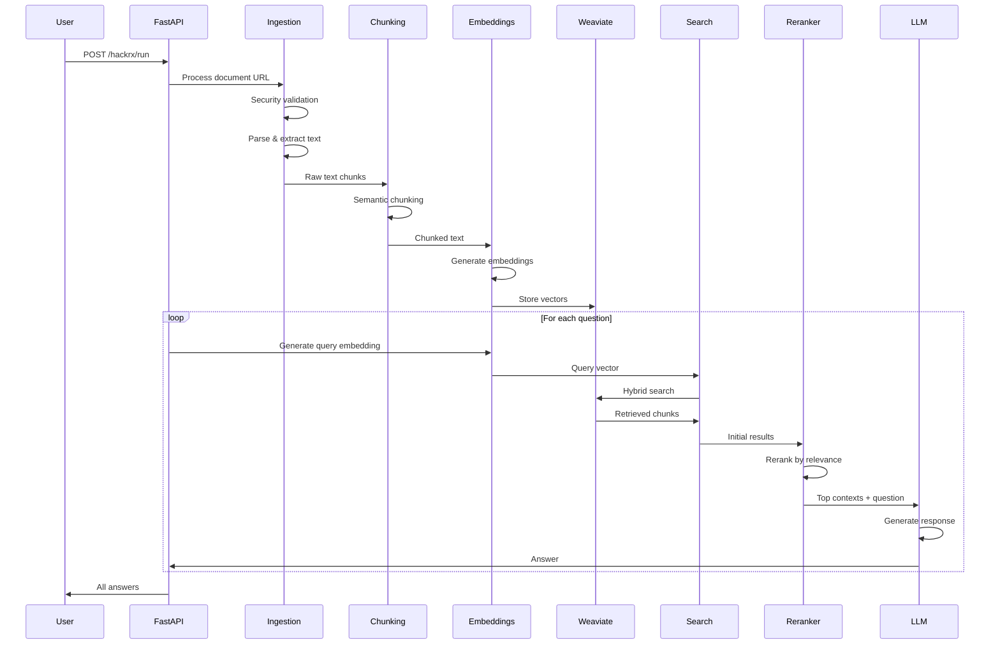
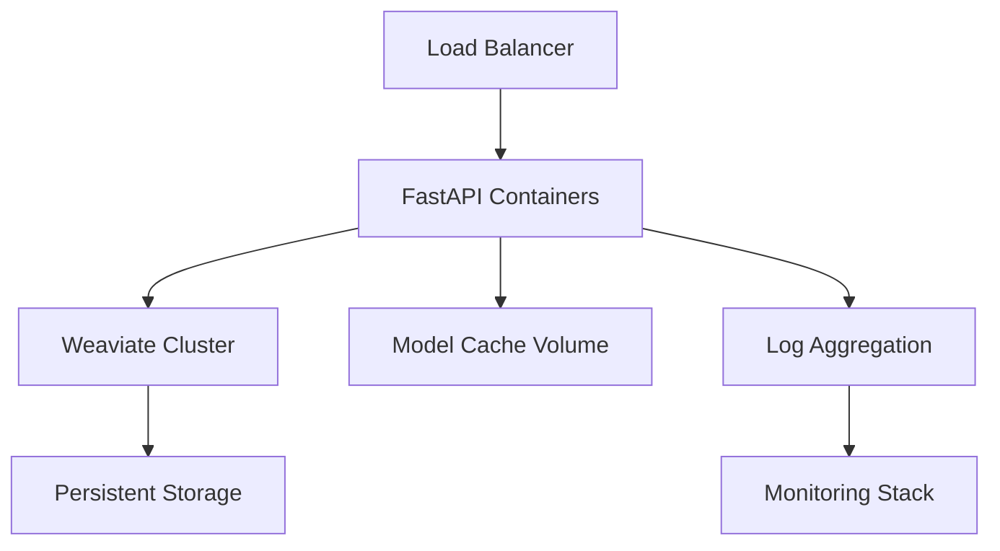

# RAG_BAJ System Architecture

## System Overview

The RAG_BAJ system is a sophisticated document processing and question-answering pipeline that leverages advanced NLP techniques, vector databases, and multiple LLM providers to deliver accurate, context-aware responses.

## High-Level Architecture



## Component Architecture

### 1. FastAPI Application Layer (`main.py`)

**Role**: Central orchestrator and API gateway

- Handles HTTP requests and routing
- Manages application lifecycle and model loading
- Implements authentication and rate limiting
- Coordinates between all system components

**Key Features**:

- Async/await support for concurrent processing
- Pre-loaded ML models for optimal performance
- Comprehensive error handling and logging
- Health checks and monitoring endpoints

### 2. Document Ingestion Engine (`components/ingest_engine.py`)

**Role**: Unified document processing with security controls



**Security Features**:

- File size validation (1GB limit)
- Extension blacklisting for dangerous files
- ZIP bomb protection with depth limits
- Content sanitization and validation

### 3. Semantic Processing Pipeline

#### Chunking Strategy (`components/chunking.py`)



**Algorithm Details**:

- Uses BGE embeddings for semantic similarity
- Configurable similarity threshold (default: 0.8)
- Size constraints: 3-12 sentences per chunk
- 10% overlap between consecutive chunks

#### Embedding Generation (`components/embeddings.py`)


**Technical Details**:

- Model: BAAI/bge-base-en-v1.5 (768 dimensions)
- Prompt template optimization for retrieval quality
- Batch processing with progress tracking
- GPU acceleration when available

### 4. Vector Database Layer (`components/weaviate_db.py`)

**Architecture**:



**Features**:

- Dynamic collection management
- Optimized batch insertion
- Connection pooling and retry logic
- Performance monitoring and metrics

### 5. Search & Retrieval System (`components/search.py`)

**Hybrid Search Architecture**:



**Implementation**:

- Alpha parameter controls vector/keyword balance
- Configurable result limits
- Score normalization and fusion
- Relevance scoring for downstream processing

### 6. Reranking System (`components/reranker_utils.py`)

**Cross-Encoder Reranking**:



**Benefits**:

- Improved relevance over initial retrieval
- Cross-attention between query and documents
- Configurable score thresholds
- Performance diagnostics and monitoring

### 7. LLM Integration Layer (`components/gemini_api.py`)

**Multi-Provider Fallback Chain**:



**Features**:

- API key rotation for rate limiting
- Automatic failover between providers
- Response quality monitoring
- Timeout and retry handling

### 8. Prompt Engineering (`components/prompt_template.py`)

**Template Structure**:

```
System Instructions
├── Task Definition
├── Response Rules
├── Quality Guidelines
└── Safety Constraints

Context Section
├── Relevance-Scored Chunks
├── Source Attribution
└── Metadata Preservation

Query Section
├── User Question
├── Answer Format
└── Response Trigger
```

### 9. Logging & Monitoring (`components/utils/logger.py`)

**Structured Logging Architecture**:



**Metrics Tracked**:

- Processing latencies by component
- API response times and errors
- Vector operations performance
- Memory and resource utilization
- Error rates and failure patterns

## Data Flow Architecture

### Complete Pipeline Flow



## Performance Characteristics

### Latency Breakdown

- Document ingestion: 2-10 seconds (varies by size/type)
- Semantic chunking: 1-3 seconds per document
- Embedding generation: 0.1-0.5 seconds per chunk
- Vector storage: 0.5-2 seconds for batch
- Search & retrieval: 100-500ms per query
- Reranking: 200-800ms for 25 candidates
- LLM generation: 1-5 seconds per answer

### Scalability Considerations

- Horizontal scaling via load balancers
- Vector database sharding for large collections
- Model serving optimization with GPU clusters
- Caching strategies for frequent queries
- Async processing for batch operations

## Security Architecture

### Defense in Depth

1. **Input Validation**: File type, size, and content validation
2. **Processing Isolation**: Sandboxed parsing and execution
3. **Resource Limits**: Memory, CPU, and time constraints
4. **API Security**: Authentication, rate limiting, CORS
5. **Data Protection**: Encryption in transit and at rest

### Threat Mitigation

- ZIP bomb detection and prevention
- Malicious file content sanitization
- API abuse protection via rate limiting
- Input injection prevention
- Resource exhaustion safeguards

## Deployment Architecture

### Container Strategy



### Infrastructure Requirements

- **Compute**: 4+ CPU cores, 16GB+ RAM per instance
- **GPU**: Optional for faster embedding generation
- **Storage**: SSD for vector database, shared volume for models
- **Network**: High bandwidth for document processing
- **Monitoring**: Prometheus, Grafana, ELK stack

## Quality Assurance

### Testing Strategy

- Unit tests for individual components
- Integration tests for pipeline flows
- Performance benchmarks and load testing
- Security vulnerability scanning
- API contract testing

### Monitoring & Alerting

- Real-time performance dashboards
- Error rate and latency alerts
- Resource utilization monitoring
- Quality score tracking
- User satisfaction metrics

This architecture provides a robust, scalable foundation for intelligent document processing and question answering, with built-in redundancy, security, and performance optimization.
