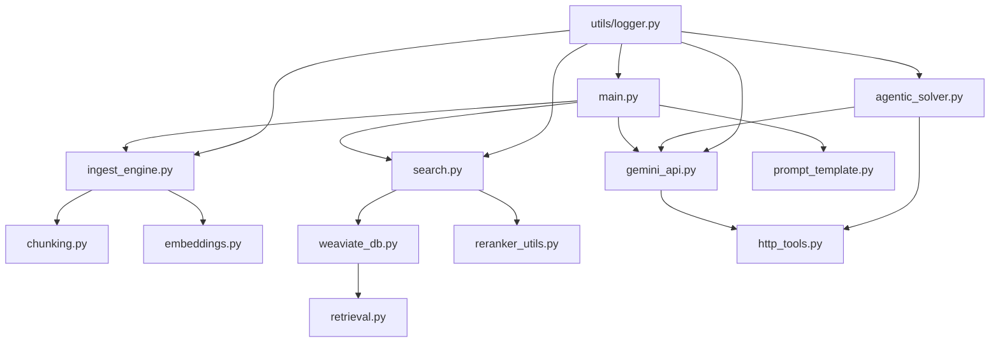
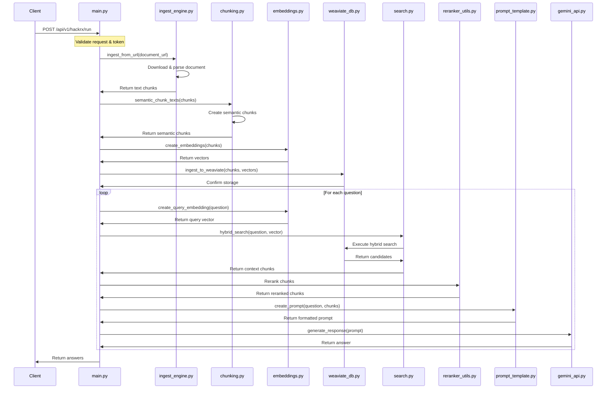

# File Structure and Architecture

This document provides detailed explanations of each file in the HackRx RAG pipeline project, explaining its purpose, functionality, and relationship with other components.

## Core Files

### `main.py`

**Purpose**: Main entry point for the FastAPI application and orchestrator for the RAG pipeline.

**Key Functions**:
- Initializes FastAPI application with lifespan management
- Pre-loads ML models (embedding model, reranker model)
- Establishes connection to Weaviate vector database
- Defines API endpoints for document processing and question answering
- Handles authentication, request validation, and error handling

**Integration Points**:
- Imports and coordinates all component modules
- Manages the full RAG pipeline from document ingestion to answer generation

### `docker-compose.yaml`

**Purpose**: Defines the containerized deployment configuration for the application and its dependencies.

**Key Components**:
- `rag-api`: The main application container
- `weaviate`: Vector database container
- Volume mappings for data persistence
- Network configuration for inter-service communication
- Environment variables for service configuration

### `Dockerfile`

**Purpose**: Defines the container build process for the RAG API application.

**Key Features**:
- Base Python image configuration
- Dependency installation
- Application code copying
- Working directory setup
- Entry point configuration

### `requirements.txt`

**Purpose**: Lists all Python dependencies required by the application.

**Key Dependencies**:
- FastAPI and Uvicorn for API framework
- Sentence Transformers for embeddings
- Weaviate client for vector database
- Document parsing libraries
- HTTP client (httpx) for external API calls

## Component Modules

### `components/agentic_solver.py`

**Purpose**: Implements an intelligent agent for solving complex riddles through chain-of-thought reasoning.

**Key Functions**:
- `solve_riddle`: Primary entry point for general riddle solving
- `solve_riddle_with_query`: Entry point for query-based riddle solving
- `AgenticQueryEngine`: Core class for agentic reasoning and HTTP interactions
- `parse_special_pdf`: Function to extract text from PDFs for agentic processing

**Algorithm Details**:
- Uses step-by-step reasoning chains
- Makes HTTP requests when needed to collect information
- Extracts and validates answers from reasoning steps
- Implements fallback mechanisms for error handling

### `components/chunking.py`

**Purpose**: Implements semantic chunking logic to divide documents into coherent, semantically meaningful chunks.

**Key Functions**:
- `semantic_chunk_texts`: Main function for chunking text based on semantic similarity
- Helper functions for similarity calculation and chunk management

**Algorithm Details**:
- Uses embedding-based similarity to determine semantic coherence
- Maintains configurable chunk sizes (min/max sentences)
- Adds configurable overlap between chunks for context continuity
- Handles edge cases like very short or very long inputs

### `components/embeddings.py`

**Purpose**: Handles creation of vector embeddings for both documents and queries.

**Key Functions**:
- `create_embeddings`: Generates embeddings for document chunks
- `create_query_embedding`: Creates embeddings for user queries
- Helper functions for batch processing and normalization

**Technical Details**:
- Uses Sentence Transformers with pre-trained models
- Implements prompt wrapping for improved retrieval quality
- Handles batch processing for efficiency
- Includes progress tracking for large datasets

### `components/gemini_api.py`

**Purpose**: Manages integration with various LLM providers, with Gemini as the primary model.

**Key Functions**:
- `generate_gemini_response_httpx`: Sends requests to Gemini API
- `generate_mistral_response_httpx`: Fallback to Mistral API
- `generate_github_models_response_httpx`: Second fallback to GitHub Models
- Helper functions for API key management and error handling

**Features**:
- API key rotation for rate limit management
- Response validation and formatting
- Error handling and fallback chains
- Timeout and retry logic

### `components/http_tools.py`

**Purpose**: Provides utilities for making HTTP requests from the application.

**Key Functions**:
- `HTTPRequestTool`: Class for managing various HTTP methods (GET, POST, etc.)
- `create_http_tool_description`: Creates formatted HTTP tool description

**Features**:
- Session management
- Error handling
- Response processing
- Request logging

### `components/ingest_engine.py`

**Purpose**: Core document ingestion pipeline handling various file formats.

**Key Functions**:
- `ingest_from_url`: Main entry point for document ingestion from URLs
- `ingest_from_file`: Entry point for local file ingestion
- Various parser functions for different file formats

**Supported File Formats**:
- PDF documents via PyMuPDF
- Images with OCR via unstructured library
- Spreadsheets
- Text and DOCX files
- ZIP archives with recursive extraction

**Security Features**:
- File size validation
- Extension blacklisting
- ZIP bomb protection
- Content sanitization

### `components/prompt_template.py`

**Purpose**: Manages prompt engineering for effective LLM interactions.

**Key Functions**:
- `create_prompt`: Builds structured prompts with context and questions
- Helper functions for formatting and context organization

**Template Structure**:
- System instructions with task definition
- Context section with relevant document chunks
- Query section with user question
- Response guidelines for format and style

### `components/reranker_utils.py`

**Purpose**: Implements result reranking to improve retrieval quality.

**Key Functions**:
- `diagnose_reranker_model`: Validates reranker model functionality
- Supporting functions for reranking operations

**Technical Details**:
- Uses cross-encoder models for query-document relevance scoring
- Implements configurable thresholds and top-k selection
- Handles batch processing for efficiency

### `components/retrieval.py`

**Purpose**: Manages document retrieval operations.

**Key Functions**:
- Functions for efficient document fetching and processing

**Features**:
- Query optimization
- Result filtering
- Context assembly

### `components/search.py`

**Purpose**: Implements hybrid search capabilities in the vector database.

**Key Functions**:
- `hybrid_search`: Main function combining vector and keyword search

**Algorithm Details**:
- Vector similarity search for semantic matching
- BM25 or keyword search for lexical matching
- Score fusion with configurable alpha parameter
- Result ranking and filtering

### `components/weaviate_db.py`

**Purpose**: Manages interactions with the Weaviate vector database.

**Key Functions**:
- `connect_to_weaviate`: Establishes connection to Weaviate
- `ingest_to_weaviate`: Stores document chunks and embeddings
- Helper functions for schema management and query operations

**Features**:
- Collection creation and management
- Batch ingestion for efficiency
- Connection pooling and retry logic
- Error handling and recovery

### `components/utils/logger.py`

**Purpose**: Implements structured logging throughout the application.

**Key Functions**:
- `setup_file_logging`: Initializes file-based logging
- `log_api_request`, `log_api_response`: API interaction logging
- `log_error`: Error event logging
- `log_service_event`: General service event logging

**Features**:
- Structured JSON formatting
- Rotation-based file output
- Console output for development
- Configurable log levels

## Test Modules

### `test/test_http_integration.py`

**Purpose**: Tests HTTP integration capabilities.

**Tests**:
- HTTP request functionality
- Response handling
- Error scenarios

### `test/test_weaviate_rerank.py`

**Purpose**: Tests Weaviate integration and reranking functionality.

**Tests**:
- Vector database connection
- Query operations
- Reranking accuracy

### `test/zip.py`

**Purpose**: Test utilities for ZIP file handling.

**Features**:
- ZIP creation/extraction
- Recursive processing tests

## Diagram: Component Interaction Flow

## Sequence Diagram: API Request Flow

The architecture is designed to be modular, extensible, and robust, with clear separation of concerns between components. This allows for easy maintenance and future enhancements.
